<!-- The panels in assets/ are generated by scripts/build.js. Edit PROFILE there and run: node scripts/build.js -->

  

  <b>Reverse engineering</b> &nbsp;·&nbsp; <b>Game hacking</b> &nbsp;·&nbsp; <b>Laravel</b> &nbsp;·&nbsp; <b>Software</b> &nbsp;·&nbsp; <b>Mobile apps</b>

## `$ whoami`

I'm Hamza, a developer from Agadir, Morocco. I take software apart to see how it really works: games, desktop apps, mobile apps, anything I can load into a debugger. Then I build the other side too.

- **Game hacking.** Cheats for ARC Raiders, DayZ, Among Us and Valheim.
- **Reverse engineering.** Desktop software and mobile apps, down to the assembly.
- **Web.** Websites and web apps built with Laravel.
- **Software.** Desktop tools, Chrome extensions, bots and mobile apps.

## `$ ls ~/arsenal`

## `$ ps -ef | grep game`

## `$ ls ~/projects`

| Project | What it does | Stack |
| :-- | :-- | :-- |
| [**discord-multi-account-switcher**](https://github.com/Farfosh/discord-multi-account-switcher) | Opens every Discord account in its own isolated Chrome profile and switches between them in one click. Never touches tokens. | Chrome extension (MV3), C# native host |
| [**telegram-web-app-pro-bot**](https://github.com/Farfosh/telegram-web-app-pro-bot) | Telegram Web App (Mini App) example for bots. | JavaScript, HTML, CSS |
| [**create-mail**](https://github.com/Farfosh/create-mail) | Generates batches of email addresses through the mail.tm API. | Python |
| [**uebs2-live-releases**](https://github.com/Farfosh/uebs2-live-releases) | Public release assets and update manifest for UEBS2 LIVE. The source is private. | Releases |

Most of my work lives in private repos.

  

